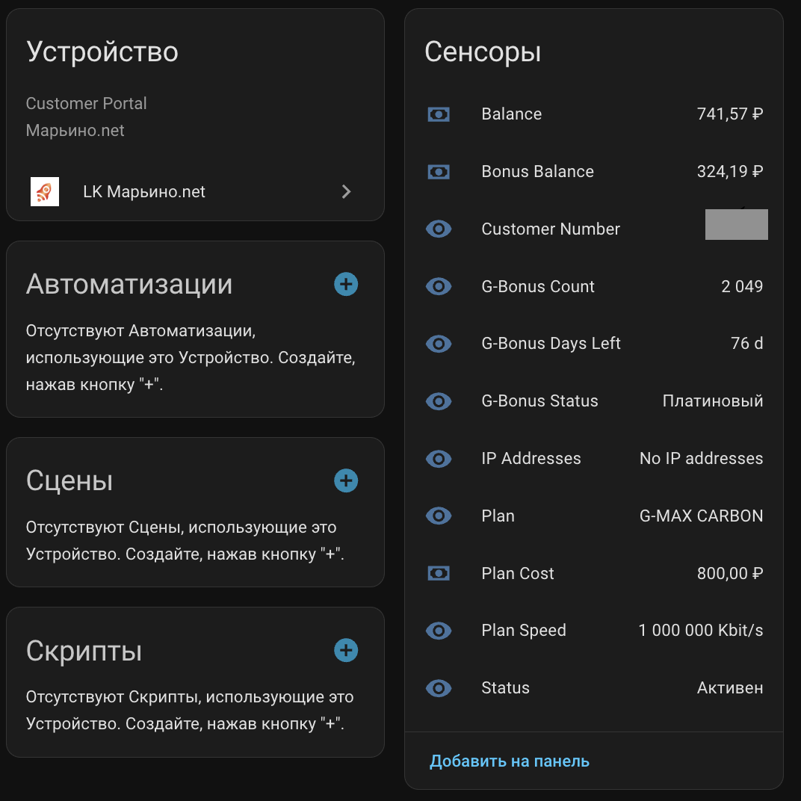
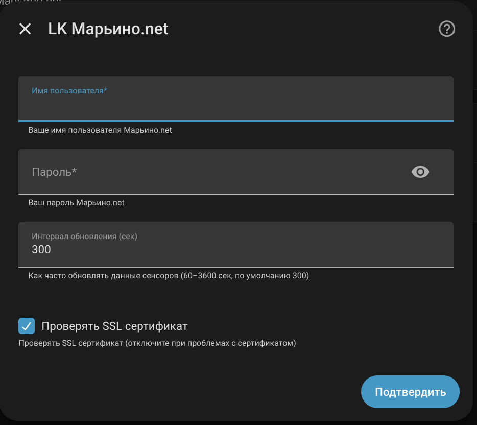

# LK Марьино.net

[](https://github.com/hacs/integration)
[](https://github.com/neooffline/lk-maryno-net/releases)

Интеграция Home Assistant для мониторинга личного кабинета Марьино.net.



## Возможности

- Баланс счёта
- Бонусный баланс
- Количество и статус G-Бонусов
- Оставшиеся дни G-Бонусов
- Текущий тариф и его стоимость
- Скорость подключения
- Статус аккаунта

## Установка

### Через HACS (рекомендуется)

1. Откройте **HACS** → **Интеграции**
2. Нажмите **⋮** → **Пользовательские репозитории**
3. Добавьте `https://github.com/neooffline/lk-maryno-net`, категория **Интеграция**
4. Найдите **LK Марьино.net** и нажмите **Установить**
5. Перезапустите Home Assistant

### Вручную

Скопируйте папку `custom_components/lk_maryno_net` в директорию `custom_components` вашего Home Assistant и перезапустите.

## Настройка

1. Перейдите в **Настройки** → **Устройства и службы**
2. Нажмите **+ Добавить интеграцию**
3. Найдите **LK Марьино.net**
4. Введите данные:

| Параметр | Описание |
|---|---|
| **Имя пользователя** | Номер договора (например, `69292`) |
| **Пароль** | Пароль от личного кабинета |
| **Интервал обновления** | Частота опроса в секундах (60–3600, по умолчанию 300) |
| **Проверять SSL** | Оставьте включённым, отключите только при проблемах с сертификатом |



После настройки интервал можно изменить через **⚙️ Настроить** → **Интервал обновления**.

## Сенсоры

| Сенсор | Описание | Единица |
|---|---|---|
| **Balance** | Текущий баланс счёта | ₽ |
| **Bonus Balance** | Бонусный баланс | ₽ |
| **Customer Number** | Номер договора | — |
| **G-Bonus Count** | Количество G-Бонусов | шт |
| **G-Bonus Days Left** | Осталось дней G-Бонусов | дн |
| **G-Bonus Status** | Статус G-Бонус (Платиновый и т.д.) | — |
| **Plan** | Название тарифа | — |
| **Plan Cost** | Стоимость тарифа | ₽ |
| **Plan Speed** | Скорость подключения | Kbit/s |
| **Status** | Статус аккаунта | — |
| **IP Addresses** | Назначенные IP-адреса | — |


## Несколько аккаунтов

Можно добавить несколько интеграций для разных договоров. Каждая будет отображаться как отдельное устройство с уникальным именем `LK Марьино.net (<номер договора>)`.

## Устранение неполадок

### Ошибка авторизации

- Убедитесь, что **имя пользователя** — это номер договора, а не email
- Проверьте пароль в личном кабинете на сайте
- Включите **debug-логирование** для `custom_components.lk_maryno_net` в `configuration.yaml`:

```yaml
logger:
  default: info
  logs:
    custom_components.lk_maryno_net: debug
```

### Проблемы с SSL

Если портал использует самоподписанный сертификат, отключите проверку SSL в настройках интеграции.

### Сенсоры не обновляются

- Проверьте **Настройки** → **Устройства и службы** → **LK Марьино.net** → **Диагностика**
- Увеличьте интервал обновления, если получаете слишком частые запросы

## Лицензия

MIT
